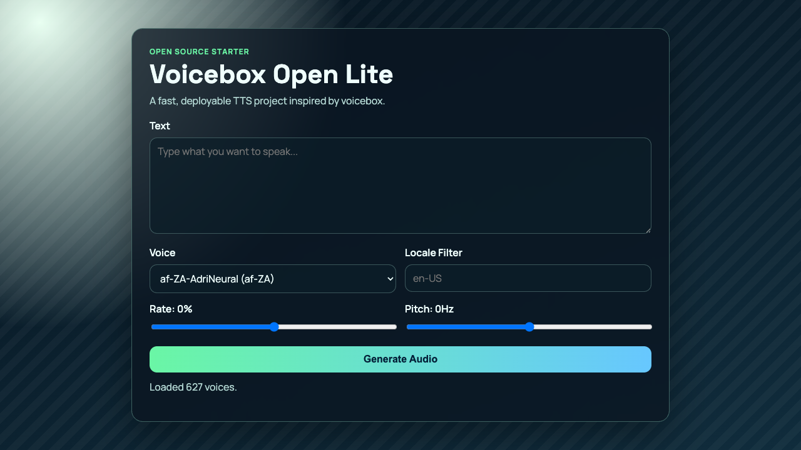

# Voicebox Open Lite

Open-source text-to-speech starter inspired by [jamiepine/voicebox](https://github.com/jamiepine/voicebox).

[](https://github.com/fzxlyd/voicebox-open-lite/actions/workflows/ci.yml)
[](./LICENSE)
[](https://www.python.org/)

This project gives you a deployable baseline with:

- FastAPI backend
- Browser UI for text input and voice selection
- MP3 generation endpoint
- Docker support
- GitHub Actions CI

## UI Preview



## Demo Features

- `GET /api/health` health check
- `GET /api/voices` list voices (optional `locale` filter)
- `POST /api/speak` synthesize speech and return audio URL

## Stack

- Python 3.11
- FastAPI + Uvicorn
- [edge-tts](https://pypi.org/project/edge-tts/)
- Plain HTML/CSS/JS frontend

## Quick Start

```bash
python3 -m venv .venv
source .venv/bin/activate
pip install -r requirements-dev.txt
uvicorn app.main:app --reload --host 0.0.0.0 --port 8000
```

Open: `http://127.0.0.1:8000`

## API Example

```bash
curl -X POST http://127.0.0.1:8000/api/speak \
  -H "Content-Type: application/json" \
  -d '{
    "text": "Hello from Voicebox Open Lite",
    "voice": "en-US-AriaNeural",
    "rate": 0,
    "pitch": 0,
    "format": "mp3"
  }'
```

Response:

```json
{
  "id": "...",
  "voice": "en-US-AriaNeural",
  "rate": 0,
  "pitch": 0,
  "format": "mp3",
  "audio_url": "/audio/<id>.mp3"
}
```

## Run Tests

```bash
pytest -q
```

## Docker

```bash
docker build -t voicebox-open-lite .
docker run --rm -p 8000:8000 voicebox-open-lite
```

## Deploy

[](https://render.com/deploy?repo=https://github.com/fzxlyd/voicebox-open-lite)

Or deploy with Render Blueprint:

```bash
render blueprint launch
```

## Project Layout

```text
.
├── app/
├── output/playwright/
├── render.yaml
├── web/
├── tests/
└── .github/workflows/ci.yml
```

## Safety Notes

- Do not use generated audio for impersonation, fraud, or deceptive use.
- Add user consent checks before deploying voice-clone features.
- If you add uploads or auth later, enforce rate limits and storage lifecycle controls.

## License

MIT
